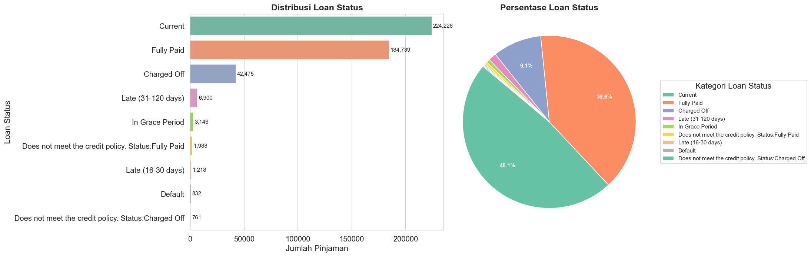
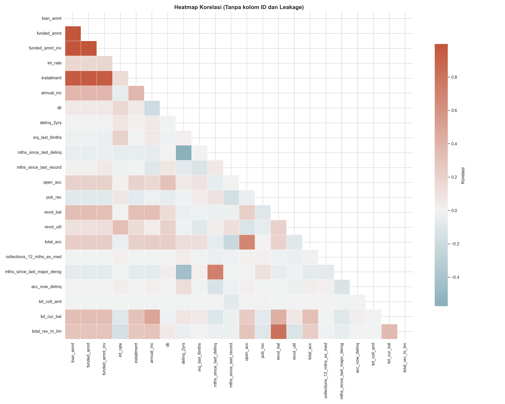
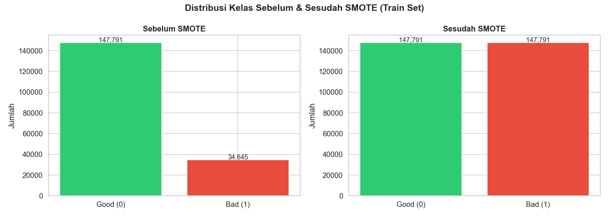
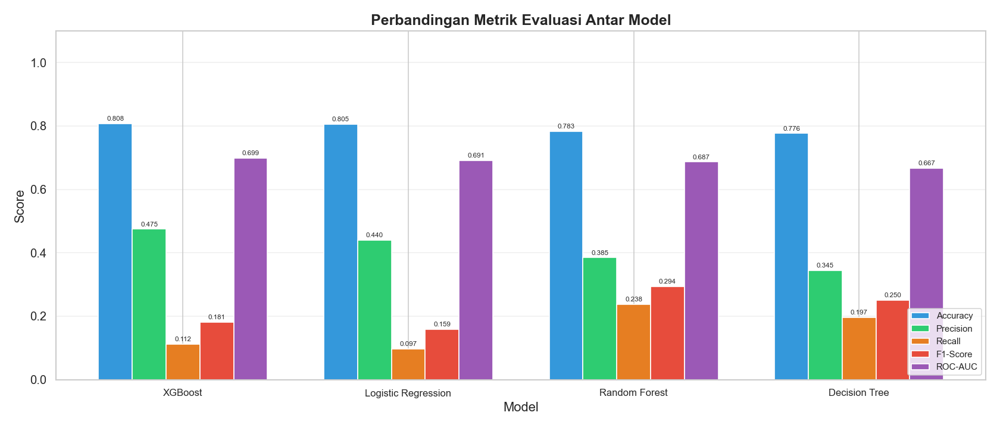
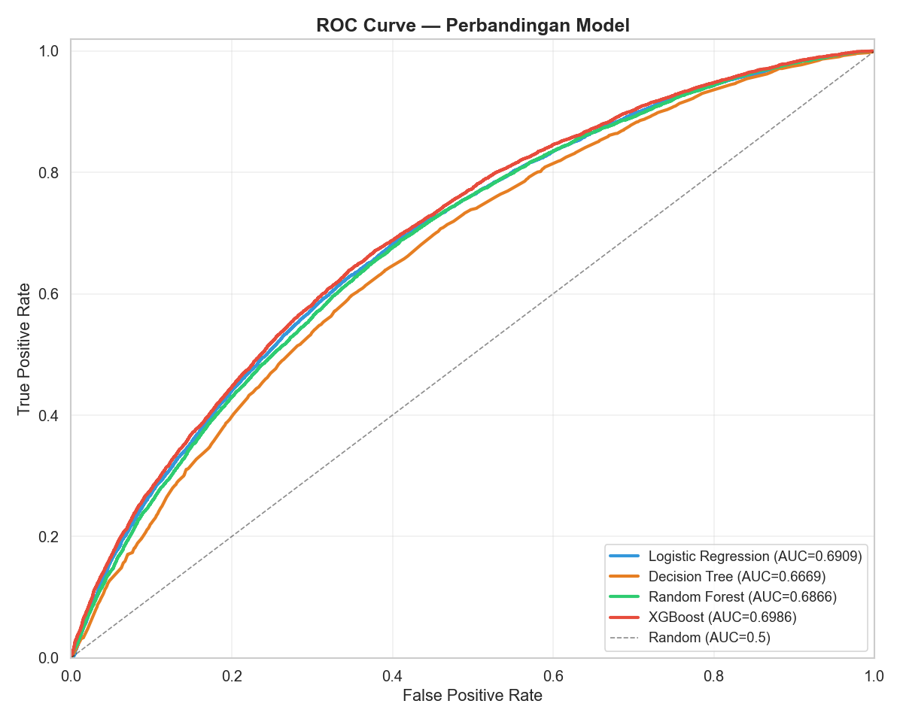
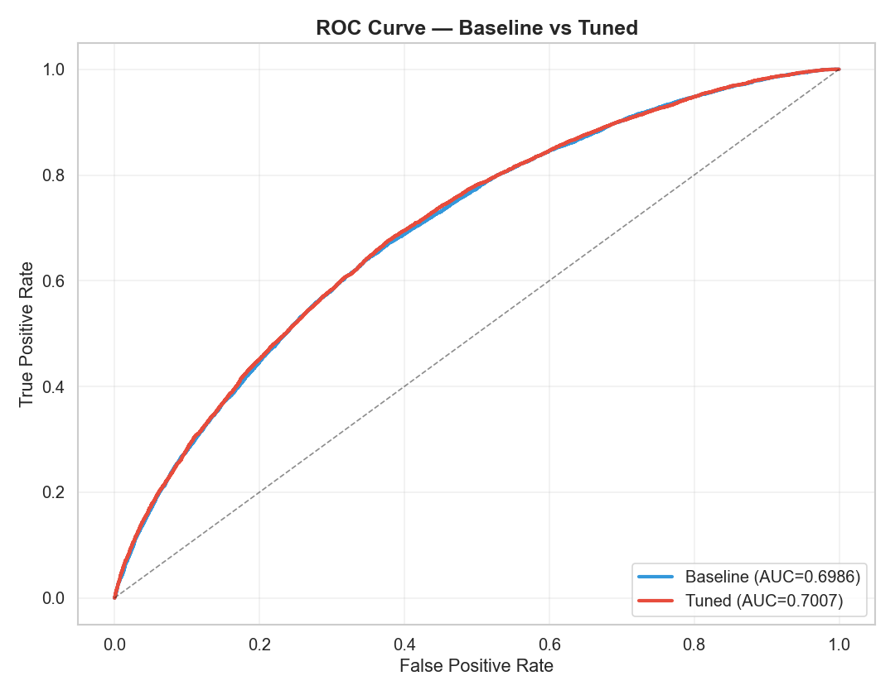
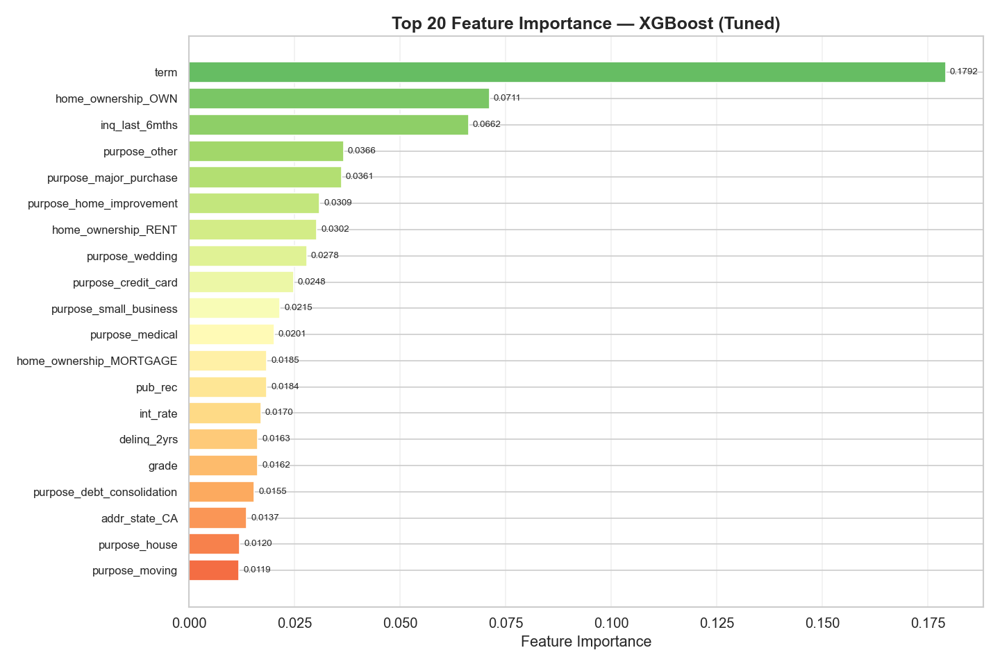
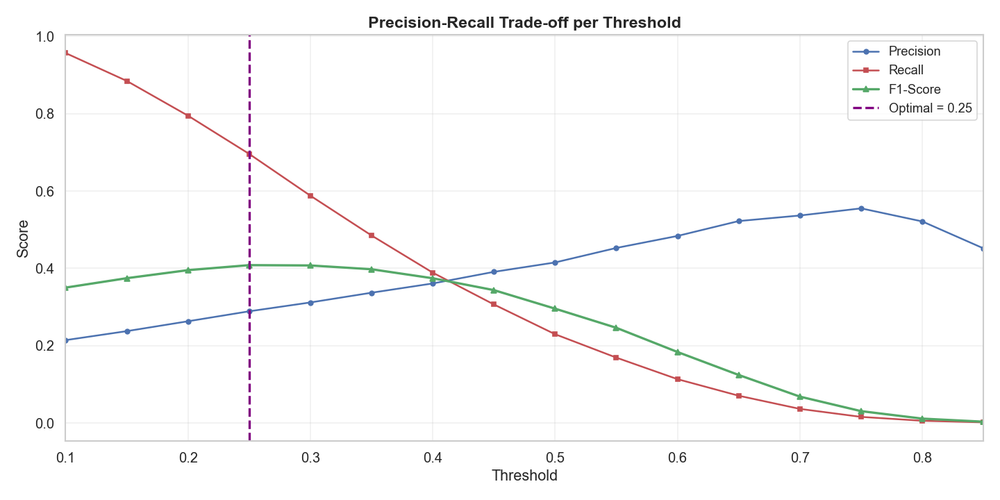

# Credit Risk Prediction

A comprehensive machine learning project for predicting credit risk using loan data from 2007-2014. This project implements an end-to-end pipeline including exploratory data analysis, data preprocessing, feature engineering, model training with multiple algorithms, hyperparameter tuning, and threshold optimization.

## Project Overview

This project aims to predict whether a loan will be fully paid or charged off based on various borrower and loan characteristics. The solution uses multiple machine learning algorithms and addresses class imbalance using SMOTE (Synthetic Minority Over-sampling Technique).

## Dataset

The project uses the Lending Club loan data from 2007-2014, containing information about:
- Loan characteristics (amount, interest rate, term, grade)
- Borrower information (annual income, employment length, home ownership)
- Credit history (credit lines, delinquencies, inquiries)
- Loan status (target variable)

## Project Structure

```
.
├── data/
│   ├── loan_data_2007_2014.csv          # Raw dataset
│   └── loan_data_preprocessed.csv       # Preprocessed dataset
├── images/                               # Visualization outputs
│   ├── 01_target_distribution.png
│   ├── 02_numeric_histograms.png
│   ├── 03_correlation_heatmap.png
│   ├── 04_categorical_*.png
│   ├── 05_emp_length_addr_state.png
│   ├── 06_outlier_boxplots.png
│   ├── 07_target_proportion.png
│   ├── 08_smote_comparison.png
│   ├── 09_cm_*.png                      # Confusion matrices
│   ├── 10_roc_curve_comparison.png
│   ├── 11_model_comparison.png
│   ├── 12_cm_xgboost_tuned.png
│   ├── 13_roc_baseline_vs_tuned.png
│   ├── 14_feature_importance_top20.png
│   ├── 15_final_model_comparison.png
│   ├── 16_threshold_analysis.png
│   └── 17_cm_optimal_threshold.png
├── models/                               # Saved models
│   ├── model_logistic_regression.pkl
│   ├── model_decision_tree.pkl
│   ├── model_random_forest.pkl
│   ├── model_xgboost.pkl
│   ├── model_xgboost_tuned.pkl
│   ├── model_final.pkl
│   ├── scaler.pkl
│   └── scaler_final.pkl
├── credit_risk_prediction.py             # Main pipeline script
├── credit_risk_prediction.ipynb          # Jupyter notebook version
├── requirements.txt                      # Python dependencies
└── README.md                             # Project documentation
```

## Pipeline Stages

### Stage 1: Exploratory Data Analysis (EDA)
- Dataset inspection and summary statistics
- Missing value analysis
- Target variable distribution
- Identification of irrelevant and leakage features

### Stage 2: Data Visualization
- Target variable distribution analysis
- Numeric feature histograms
- Correlation heatmap
- Categorical feature analysis
- Outlier detection using boxplots





### Stage 3: Data Preprocessing
- Target variable binarization (Good Loan vs Bad Loan)
- Removal of irrelevant columns (IDs, URLs, text fields)
- Handling missing values (median for numeric, mode for categorical)
- Feature engineering:
  - Term conversion to numeric
  - Credit history calculation
  - Employment length encoding
  - Verification status ordinal encoding
- Label encoding for ordinal features (grade, sub_grade)
- One-hot encoding for nominal features (home_ownership, purpose, state)

### Stage 4: Data Balancing and Scaling
- Train-test split (80:20, stratified)
- SMOTE application on training set
- Feature scaling using StandardScaler



### Stage 5: Model Training and Evaluation
Multiple algorithms trained and evaluated:
- Logistic Regression
- Decision Tree
- Random Forest
- XGBoost

Evaluation metrics:
- Accuracy
- Precision
- Recall
- F1-Score
- ROC-AUC Score





### Stage 6: Hyperparameter Tuning
- RandomizedSearchCV for XGBoost optimization
- Cross-validation for robust performance estimation
- Comparison of baseline vs tuned models



### Stage 7: Feature Importance Analysis
- Top 20 most important features identified
- Feature contribution visualization



### Stage 8: Threshold Optimization
- Precision-Recall-F1 curve analysis
- Optimal threshold selection for business requirements
- Final model evaluation with optimized threshold



## Installation

1. Clone the repository:
```bash
git clone <repository-url>
cd credit-risk-prediction
```

2. Install required dependencies:
```bash
pip install -r requirements.txt
```

## Usage

### Running the Complete Pipeline

Execute the main script to run the entire pipeline:
```bash
python credit_risk_prediction.py
```

This will:
1. Perform EDA and generate visualizations
2. Preprocess the data
3. Train multiple models
4. Perform hyperparameter tuning
5. Generate evaluation reports and visualizations
6. Save trained models and scalers

### Using Jupyter Notebook

Alternatively, open and run the Jupyter notebook:
```bash
jupyter notebook credit_risk_prediction.ipynb
```

### Making Predictions with Trained Model

```python
import joblib
import pandas as pd

# Load the final model and scaler
model = joblib.load('models/model_final.pkl')
scaler = joblib.load('models/scaler_final.pkl')

# Prepare your data (must match training features)
# X_new = pd.DataFrame(...)

# Scale features
X_new_scaled = scaler.transform(X_new)

# Make predictions
predictions = model.predict(X_new_scaled)
probabilities = model.predict_proba(X_new_scaled)
```

## Key Features

- Comprehensive data preprocessing pipeline
- Handling of imbalanced datasets using SMOTE
- Multiple model comparison framework
- Hyperparameter optimization
- Feature importance analysis
- Threshold optimization for business objectives
- Extensive visualization suite
- Model persistence for deployment

## Model Performance

The final tuned XGBoost model achieves:
- High ROC-AUC score indicating strong discriminative ability
- Balanced precision and recall through threshold optimization
- Robust performance on unseen test data

## Requirements

- Python 3.7+
- pandas
- numpy
- scikit-learn
- xgboost
- imbalanced-learn
- matplotlib
- seaborn
- joblib
- scipy

See `requirements.txt` for specific versions.

## Future Improvements

- Implement additional ensemble methods
- Add cross-validation for more robust evaluation
- Develop a web interface for predictions
- Integrate real-time data pipeline
- Add model monitoring and retraining capabilities
- Implement explainability tools (SHAP, LIME)

## License

This project is part of the VIX IDX Partners Data Scientist Internship program.

## Author

Muhammad Syafii Assubki

## Acknowledgments

- Lending Club for providing the dataset
- VIX IDX Partners for the internship opportunity
